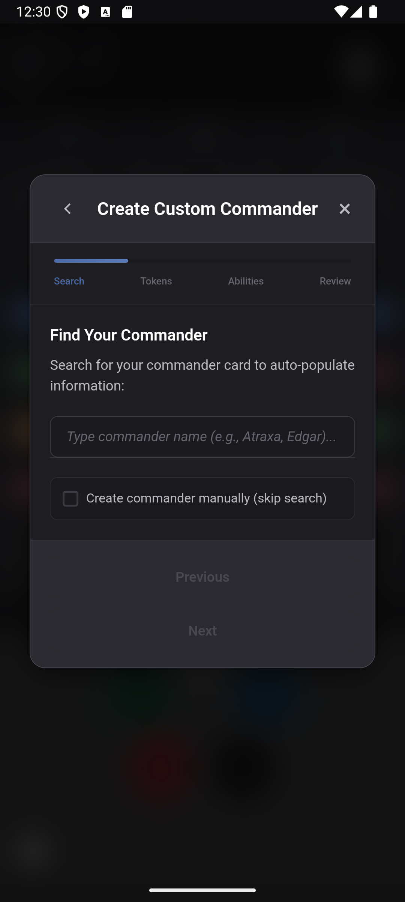

# MTG Token Calculator
**A mobile app for tracking creature tokens during Magic: The Gathering Commander games**

&nbsp;&nbsp;&nbsp;&nbsp;

<em>Dark theme &nbsp;&nbsp;&nbsp;&nbsp;&nbsp;&nbsp;&nbsp;&nbsp;&nbsp;&nbsp;&nbsp;&nbsp;&nbsp;&nbsp;&nbsp;&nbsp;&nbsp;&nbsp;&nbsp;&nbsp;&nbsp;&nbsp;&nbsp;&nbsp;&nbsp;&nbsp;&nbsp;&nbsp;&nbsp;&nbsp;&nbsp;&nbsp;&nbsp;&nbsp;&nbsp;&nbsp;&nbsp;&nbsp;&nbsp;&nbsp; Light theme</em>

## Currently in Closed Testing on the Play Store
 Google requires 12+ active testers for 14 days before approving apps for public release. Google's testing system forces you to either collect individual email addresses OR use Google Groups.
- If you want to help me test the app you can join the Google Group here: https://groups.google.com/forum/#!forum/mtg-token-calculator-test/join
- You can find the App here: https://play.google.com/store/apps/details?id=com.github.doctorpaxmor.tokencalculator

If you can help test, **please** review the app using the Play Store, it will help me immensely

## What It Does
MTG Token Calculator helps Commander players manage creature tokens during gameplay. Instead of using dice, counters, or paper to track your growing token armies, this calculator handles the math for you.

## Key Features

  

**Built-in Commanders**
- Pre-configured with popular token commanders
- Each commander has specific token types and abilities already set up

**Token Multiplier System**  
- Automatic calculation with Doubling Season, Parallel Lives, and other token doublers
- Stack multiple multipliers and see the final count instantly
- Manual multiplier adjustments for unique scenarios

**Custom Content**
- Create custom commanders for any deck
- Add custom multipliers for any token-affecting card
- Import/export configurations to share with other players

  

**Game State Management**
- Tracks both untapped and tapped tokens separately
- Automatic saving - resume games exactly where you left off
- Each commander remembers its own token counts

## How It Works
1. Select your commander (or create a custom one)
2. Toggle on any token-doubling effects you have in play
3. Use the calculator to add/remove tokens as you play
4. The app handles all the multiplication math automatically

## Documentation
**📖 [Complete Wiki Guide](https://github.com/doctor-paxmor/token-calculator/wiki)**
- **[Quick Start](https://github.com/doctor-paxmor/token-calculator/wiki/Quick-Start-Guide)** - Get up and running in 5 minutes
- **[Commander Guide](https://github.com/doctor-paxmor/token-calculator/wiki/Commander-Guide)** - Built-in commanders and selection
- **[Token Guide](https://github.com/doctor-paxmor/token-calculator/wiki/Token-Guide)** - Token tracking and management
- **[Multiplier Guide](https://github.com/doctor-paxmor/token-calculator/wiki/Multiplier-Guide)** - How token doublers work
- **[Custom Commanders](https://github.com/doctor-paxmor/token-calculator/wiki/Custom-Commanders)** - Create your own commanders
- **[Custom Multipliers](https://github.com/doctor-paxmor/token-calculator/wiki/Custom-Multipliers)** - Add custom token effects
- **[Settings Guide](https://github.com/doctor-paxmor/token-calculator/wiki/Settings-Guide)** - App configuration
- **[Troubleshooting](https://github.com/doctor-paxmor/token-calculator/wiki/Troubleshooting)** - Fix common issues

## Built-in Commanders
- **Adrix & Nev, Twincasters**
- **Baylen, the Haymaker**
- **Chatterfang, Squirrel General**
- **Jinnie Fay, Jetmir's Second**
- **Krenko, Mob Boss**
- **Mahadi, Emporium Master**
- **Rinseri, Swift Speaker**

## Built-in Multipliers
- **Doubling Season** (×2) - All tokens
- **Parallel Lives** (×2) - Creature tokens  
- **Mondrak** (×2) - All tokens
- **Anointed Procession** (×2) - Creature tokens
- **Primal Vigor** (×2) - All tokens
- **Ojer Taq** (×3) - Creature tokens

## Support
- **[Wiki Documentation](https://github.com/doctor-paxmor/token-calculator/wiki)** - Complete guides and tutorials
- **[Report Issues](https://github.com/doctor-paxmor/token-calculator/issues)** - Bug reports and feature requests
